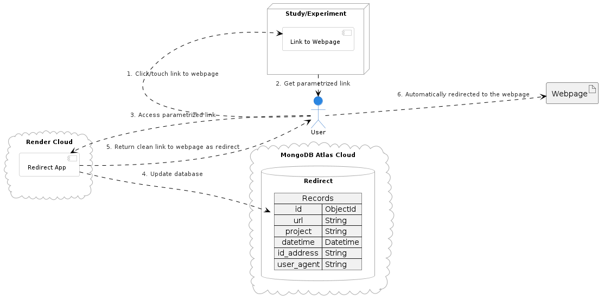

# A tool to measure user engagement on a study

This tool is a simple way to measure user engagement on a study. It uses a redirect service to track the number of clicks on a link. The tool is designed to be used with with any link.

## How to use

The tool is deployed at [https://redirect-7oww.onrender.com/](https://redirect-7oww.onrender.com/). To use the tool, you need to provide the following parameters:

- `project`: The name of the project you are working on. This is used to identify the project in the database.
- `url`: The URL you want to track.

The tool will redirect the user to the URL provided in the `url` parameter and log the click in the database.

To download a CSV file with the current data for project `PROJECT`, you can visit the following URL:

[https://redirect-7oww.onrender.com/csv?project=PROJECT](https://redirect-7oww.onrender.com/csv?project=PROJECT)

## How it works

The service is built in Python with [FastAPI](https://fastapi.tiangolo.com/) and uses [MongoDB](https://www.mongodb.com/) to store the data. The service has three endpoints:

- `/`: Redirects the user to the URL provided in the `url` parameter and logs the click in the database.
  - Parameter `project`: The name of the project you are working on.
  - Parameter `url`: The URL you want to track.
- `/json`: Returns the data in JSON format.
  - Parameter `project`: The name of the project you are working on.
- `/csv`: Returns the data in CSV format.
  - Parameter `project`: The name of the project you are working on.
- `/ping`: A simple endpoint to check if the service is running.

The service is deployed on [Render](https://render.com/) and uses a [MongoDB Atlas](https://www.mongodb.com/cloud/atlas) database.

The service is kept alive using [cron-job.org](https://cron-job.org/).

### Architecture



## Development

To run a development environment using [Docker](https://www.docker.com/), execute:

```bash
docker-compose up --build --force-recreate --renew-anon-volumes
```

The service will be available at [http://localhost:8000](http://localhost:8000).

Try it with curl with:

```bash
curl http://localhost:8000/?project=test&url=https://www.google.com
```

Check the new record with:

```bash
curl http://localhost:8000/json?project=test
```

or

```bash
curl http://localhost:8000/csv?project=test
```

[Mongo Express](https://github.com/mongo-express/mongo-express) will be available at [http://localhost:8081](http://localhost:8081).